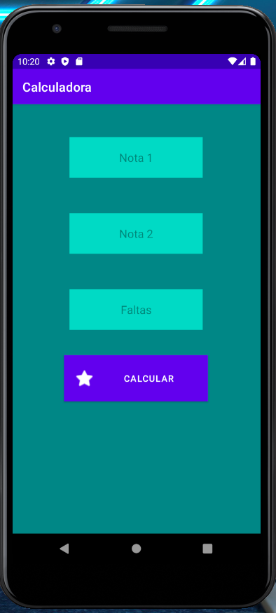
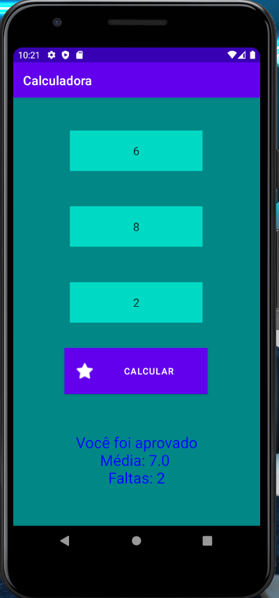
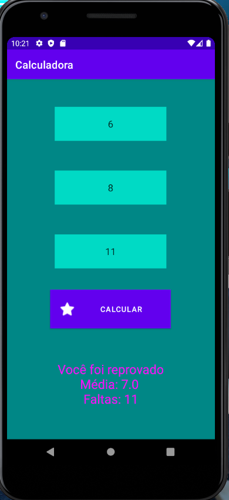

# Será que você passou?

 - Este aplicativo nada mais é que uma calculadora simples, que leva em conta duas notas e a quantidade de faltas do aluno.

 - Se a média ficar acima ou igual a 6, e o aluno não faltar mais de 10 vezes, ele passa (cor azul)

 - Caso contrário, o texto será na cor magenta

  

  

